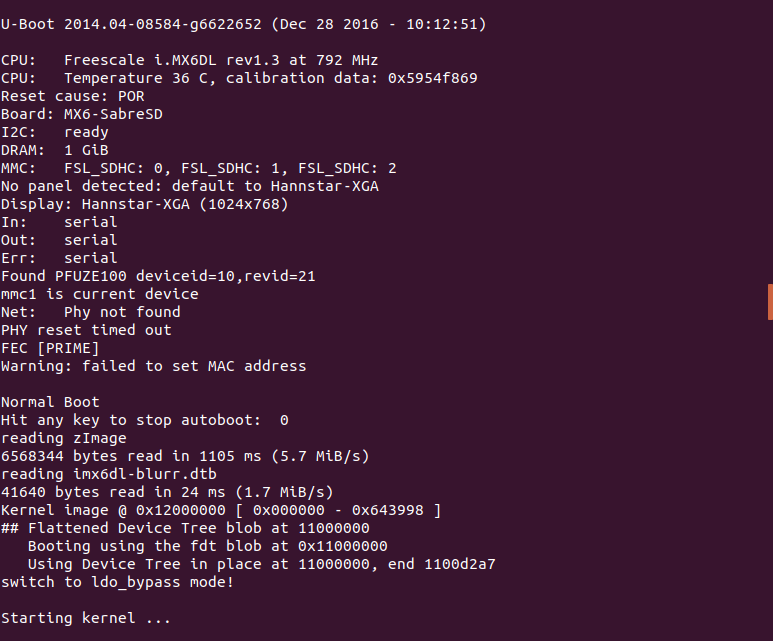
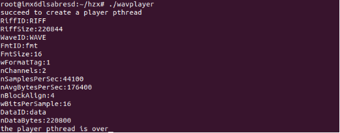

.. _alsa:

ALSA播放WAV音频
============================

ALSA讲解
----------------------------

- **ALSA介绍**

ALSA是Advanced Linux Sound Architecture，高级Linux声音架构的简称。
它包含一组kernel驱动，一个应用编程接口(API)库以及一组工具函数。

（1）ALSA API

  + Control 接口：一个通用的功能，用来管理声卡的寄存器以及查询可用设备。
  + PCM 接口：管理数字audio capture和playback的接口，这是audio应用最常用的接口。
  + Raw MIDI 接口：支持MIDI(Musical Instrument DIgital Interface，电子音乐设备的标准)。这个API提供了对声卡MIDI bus的访问。
  + Timer 接口：提供对声卡上计时硬件的访问，用于同步声音事件。
  + Sequencer 接口：一个MIPI编程和声音同步接口，比raw MIDI接口级别更高，它管理大部分MIDI协议和计时。
  + Mixer 接口：控制声卡上的信号路由和音量调节的设备，它是建立在control接口之上的。

（2）设备命名

API操作的是逻辑设备名而不是设备文件，设备名可以是真正的硬件设备或者插件。
硬件设备使用hw:i,j这种格式，i是卡号而j是在这个卡上的设备。
第一个声音设备是hw:0,0，第一个sound设备的别名为defalut。

（3）编程方法

通常可以用下面的伪代码表示PCM接口编程模式：
::

    open interface for capture or playback  
    set hardware parameters(access mode, data format, channels, rate, etc.)  
    while there is data to be processed:  
        read PCM data(capture) or write PCM data(playback)  
    close interface

- **代码讲解**

指定使用最新的ALSA API：
::

    #define ALSA_PCM_NEW_HW_PARAMS_API

头文件、宏定义：
::

    #include <sys/types.h>
    #include <sys/stat.h>
    #include <fcntl.h>
    #include <unistd.h>
    #include <stdio.h>
    #include <stdlib.h>
    #include <string.h>
    #include <alsa/asoundlib.h>
    #include <pthread.h>

    #define u32 unsigned int
    #define u8  unsigned char
    #define u16 unsigned short

定义WAV音频格式和头部结构体：
::

    typedef  struct
    {
        u32     dwSize;
        u16     wFormatTag;
        u16     wChannels;
        u32     dwSamplesPerSec;
        u32     dwAvgBytesPerSec;
        u16     wBlockAlign;
        u16     wBitsPerSample;
    } WAVEFORMAT;

    typedef  struct
    {
        u8      RiffID[4];
        u32     RiffSize;
        u8      WaveID[4];
        u8      FmtID[4];
        u32     FmtSize;
        u16     wFormatTag;
        u16     nChannels;
        u32     nSamplesPerSec;
        u32     nAvgBytesPerSec;
        u16     nBlockAlign;
        u16     wBitsPerSample;
        u8      DataID[4];
        u32     nDataBytes;
    } WAVE_HEADER;

定义变量：
::

    snd_pcm_t *gp_handle;    //调用snd_pcm_open打开PCM设备返回的文件句柄，后续的操作都是使用这个句柄操作PCM设备
    snd_pcm_hw_params_t *gp_params;    //设置流的硬件参数
    snd_pcm_uframes_t g_frames;
    char *gp_buffer;
    u32 g_bufsize;
    char filename[30];    //音频文件全局变量

定义一个函数，打开给定的WAV文件，输出其头部信息：
::

    FILE * open_and_print_file_params(char *file_name)
    {
        FILE * fp = fopen(file_name, "r");
        if (fp == NULL)
        {
            printf("can't open wav file\n");
            return NULL;
        }

        memset(&g_wave_header, 0, sizeof(g_wave_header));
        fread(&g_wave_header, 1, sizeof(g_wave_header), fp);
        
        printf("RiffID:%c%c%c%c\n", g_wave_header.RiffID[0], g_wave_header.RiffID[1], g_wave_header.RiffID[2], g_wave_header.RiffID[3]);
        printf("RiffSize:%d\n", g_wave_header.RiffSize);
        printf("WaveID:%c%c%c%c\n", g_wave_header.WaveID[0], g_wave_header.WaveID[1], g_wave_header.WaveID[2], g_wave_header.WaveID[3]);
        printf("FmtID:%c%c%c%c\n", g_wave_header.FmtID[0], g_wave_header.FmtID[1], g_wave_header.FmtID[2], g_wave_header.FmtID[3]);
        printf("FmtSize:%d\n", g_wave_header.FmtSize);
        printf("wFormatTag:%d\n", g_wave_header.wFormatTag);
        printf("nChannels:%d\n", g_wave_header.nChannels);
        printf("nSamplesPerSec:%d\n", g_wave_header.nSamplesPerSec);
        printf("nAvgBytesPerSec:%d\n", g_wave_header.nAvgBytesPerSec);
        printf("nBlockAlign:%d\n", g_wave_header.nBlockAlign);
        printf("wBitsPerSample:%d\n", g_wave_header.wBitsPerSample);
        printf("DataID:%c%c%c%c\n", g_wave_header.DataID[0], g_wave_header.DataID[1], g_wave_header.DataID[2], g_wave_header.DataID[3]);
        printf("nDataBytes:%d\n", g_wave_header.nDataBytes);
        
        return fp;
    }

定义一个函数，设置PCM硬件参数：
::

    int set_hardware_params()
    {
        int rc;
        /* Open PCM device for playback */
        rc = snd_pcm_open(&gp_handle, "default", SND_PCM_STREAM_PLAYBACK, 0);
        if (rc < 0)
        {
            printf("unable to open pcm device\n");
            return -1;
        }

        /* Allocate a hardware parameters object */
        snd_pcm_hw_params_alloca(&gp_params);

        /* Fill it in with default values. */
        rc = snd_pcm_hw_params_any(gp_handle, gp_params);
        if (rc < 0)
        {
            printf("unable to Fill it in with default values.\n");
            goto err1;
        }

        /* Interleaved mode */
        rc = snd_pcm_hw_params_set_access(gp_handle, gp_params, SND_PCM_ACCESS_RW_INTERLEAVED);
        if (rc < 0)
        {
            printf("unable to Interleaved mode.\n");
            goto err1;
        }

        snd_pcm_format_t format;
        if (8 == g_wave_header.FmtSize)
        {
            format = SND_PCM_FORMAT_U8;
        }
        else if (16 == g_wave_header.FmtSize)
        {
            format = SND_PCM_FORMAT_S16_LE;
        }
        else if (24 == g_wave_header.FmtSize)
        {
            format = SND_PCM_FORMAT_U24_LE;
        }
        else if (32 == g_wave_header.FmtSize)
        {
            format = SND_PCM_FORMAT_U32_LE;
        }
        else
        {
            printf("SND_PCM_FORMAT_UNKNOWN.\n");
            format = SND_PCM_FORMAT_UNKNOWN;
            goto err1;
        }

        /* set format */
        rc = snd_pcm_hw_params_set_format(gp_handle, gp_params, format);
        if (rc < 0)
        {
            printf("unable to set format.\n");
            goto err1;
        }

        /* set channels (stero) */
        snd_pcm_hw_params_set_channels(gp_handle, gp_params, g_wave_header.nChannels);
        if (rc < 0)
        {
            printf("unable to set channels (stero).\n");
            goto err1;
        }

        /* set sampling rate */
        u32 dir, rate = g_wave_header.nSamplesPerSec;
        rc = snd_pcm_hw_params_set_rate_near(gp_handle, gp_params, &rate, &dir);
        if (rc < 0)
        {
            printf("unable to set sampling rate.\n");
            goto err1;
        }

        /* Write the parameters to the dirver */
        rc = snd_pcm_hw_params(gp_handle, gp_params);
        if (rc < 0)
        {
            printf("unable to set hw parameters: %s\n", snd_strerror(rc));
            goto err1;
        }

        snd_pcm_hw_params_get_period_size(gp_params, &g_frames, &dir);
        g_bufsize = g_frames * 4;
        gp_buffer = (u8 *)malloc(g_bufsize);
        if (gp_buffer == NULL)
        {
            printf("malloc failed\n");
            goto err1;
        }

        return 0;

    err1:
        snd_pcm_close(gp_handle);
        return -1;
    }

定义播放函数，播放指定的WAV音频：
::

    int play_wav(char *file)
    {
        FILE * fp = open_and_print_file_params(file);
        if (fp == NULL)
        {
            printf("open_and_print_file_params error\n");
            return -1;
        }

        int ret = set_hardware_params();
        if (ret < 0)
        {
            printf("set_hardware_params error\n");
            return -1;
        }

        size_t rc;
        while (1)
        {
            rc = fread(gp_buffer, g_bufsize, 1, fp);
            if (rc <1)
            {
                break;
            }

            while ((ret = snd_pcm_writei(gp_handle, gp_buffer, g_frames)) < 0)
            {
                snd_pcm_prepare(gp_handle);
                fprintf(stderr, "buffer underrun occured\n");
            }
        }

        /* 将handle冲刷干净，关闭流，释放buffer */
        snd_pcm_drain(gp_handle);
        snd_pcm_close(gp_handle);
        free(gp_buffer);
        fclose(fp);
        return 1;
    }

定义播放线程函数，播放一次WAV音频：
::

    void *play_thread()
    {
        play_wav(filename);
    }

主函数中定义一个播放线程，播放指定的WAV音频，并等待线程结束：
::

    int main()
    {
        char audio1[] = "low.wav";
        char audio2[] = "middle.wav";
        char audio3[] = "high.wav";
        strcpy(filename, audio2);

        pthread_t player;
        if(pthread_create(&player, NULL, play_thread, NULL) == -1)
            printf("fail to create a player pthread\n");
        else
            printf("succeed to create a player pthread\n");

        pthread_join(player, NULL);
        printf("the player pthread is over\n");
        return 0;
    }

直接编译
----------------------------

- **PC环境安装**

从ALSA官网（https://www.alsa-project.org/main/index.php/Main_Page）下载alsa-lib，这里以alsa-lib-1.1.5为例。
解压下载下来的ALSA库压缩包，并进入解压后的文件目录：
::

    tar -xjf alsa-lib-1.1.5.tar.bz2
    cd alsa-lib-1.1.5
    
配置、编译、安装：
::

    sudo ./configure
    sudo make
    sudo make install

- **直接编译**

在PC（Linux操作系统）上，打开终端，进入到c源文件所在的目录，编译时连接ALSA库和线程库：
::

    gcc wavplayer.c -o wavplayer -lasound -lpthread

然后把wav音频文件（high.wav，middle.wav，low.wav）拷贝到当前目录下，运行刚刚生成的可执行文件：
::

    ./wavplaye

在PC的音响中就可以听到播放出的wav音频。

交叉编译
----------------------------

- **PC环境安装**

在这里要使用arm-linux-gnueabihf工具链来交叉编译c源文件，生成的可执行文件才可以移植到blurr板上运行。
首先在Linux系统上安装工具链：
::

    sudo apt-get install gcc-arm-linux-gnueabihf

为避免一些错误，再执行下面这条命令：
::

    sudo apt-get install build-essential gcc

然后安装ALSA库：
::

    sudo rpm2cpio alsa-lib-dev-1.1.0-r0.cortexa9hf_neon_mx6qdl.rpm | cpio -idv
    sudo cp usr/* -a /usr/arm-linux-gnueabihf

注：如果该rpm包/usr/lib中缺少“libasound.so.2.0.0”文件，再将该文件拷贝进去：
::

    sudo cp libasound.so.2.0.0 /usr/arm-linux-gnueabihf/lib

- **交叉编译**

交叉编译时，同样需要连接lasound和lpthread库：
::

    arm-linux-gnueabihf-gcc wavplayer.c -o wavplayer -lasound -lpthread

- **Blurr启动与环境安装**

按照一下连接方式将blurr板通过USB线连接至电脑，并插上电源为其供电。

先查找blurr板连接的端口号（这里是/dev/ttyUSB0），然后使用picocom命令连接：
::

    sudo picocom -b 115200 /dev/ttyUSB0

然后在blurr板上按下reset键，可以看到一下启动信息：

启动加载完后，输入登录名root即可进行blurr板文件系统中：

在blurr板上也需要安装ALSA库：
::

    rpm -ivh alsa-lib-dev-1.1.0-r0.cortexa9hf_neon_mx6qdl.rpm

- **运行**

将交叉编译好的可执行文件wavplayer和wav音频文件（high.wav，middle.wav，low.wav）通过U盘拷贝到blurr板上。
首先将U盘插在blurr板的USB口上，挂载进来：
::

    mount /dev/sda1 /mnt

拷贝可执行文件、音频文件到用户目录下（alsa为自己创建的文件夹）：
::

    cd /mnt
    cp wavplayer ~/alsa
    cp *.wav ~/alsa

运行：
::

    cd ~/alsa
    ./wavplayer

将耳机插入blurr板绿色耳机孔中，就可以听到播放出的wav音频。

