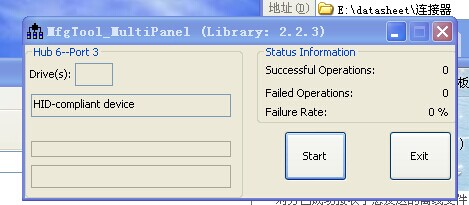
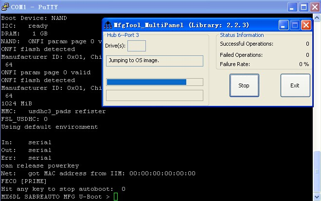
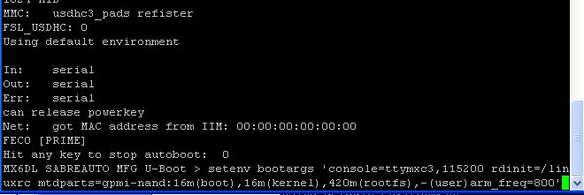
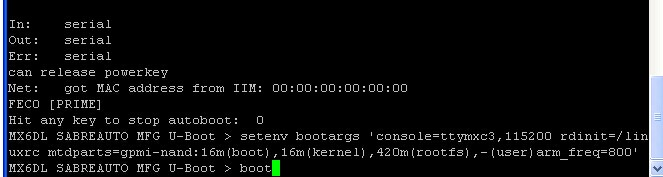
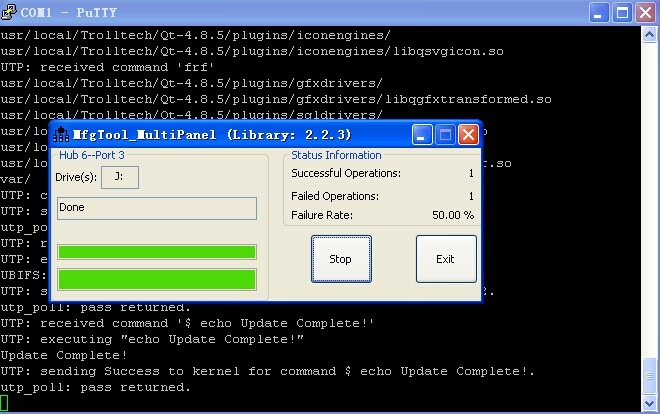

烧写镜像和文件系统
========================================

烧写
-------------------------------------

1. 打开烧写工具mfg，成功识别为HID设备（mini usb连接）
 注（烧写之前设置启动为serial download模式）

2. 启动串口终端，并设置波特率为115200
进入终端，出现烧写进程，按回车键进入uboot命令端

3. 输入烧写nand分区配置,按回车键继续。

分区配置：

``setenv bootargs 'console=ttymxc3,115200 rdinit=/linuxrc mtdparts=gpmi-nand:16m(boot),16m(kernel),420m(rootfs),-(user)arm_freq=800'``

4. 输入boot命令，回车进行烧写，等待烧写完成。

5. 烧写成功

6. 断电，设置启动模式为nand启动，上电重启

7. 进入uboot终端设置启动参数

``setenv bootargs 'console=ttymxc3,115200n8 ubi.mtd=2 root=ubi0:rootfs rootfstype=ubifs rootwait rw mtdparts=gpmi-nand:16m(boot),16m(kernel),420m(rootfs),-(user) video=mxcfb1:dev=lcd,CLAA-WVGA,if=RGB24 video=mxcfb0:dev=ldb,LDB-XGA,if=RGB666'``

``saveenv``
